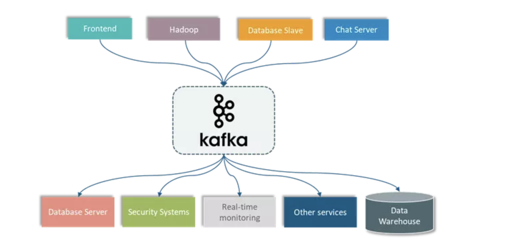
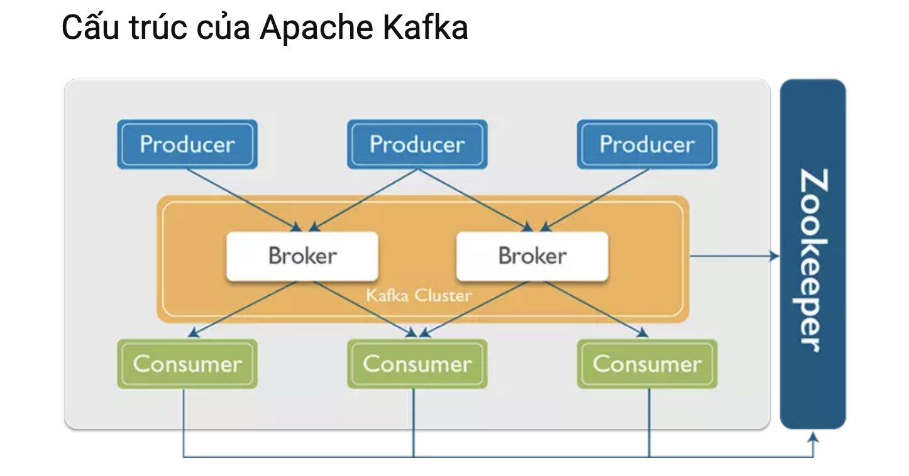
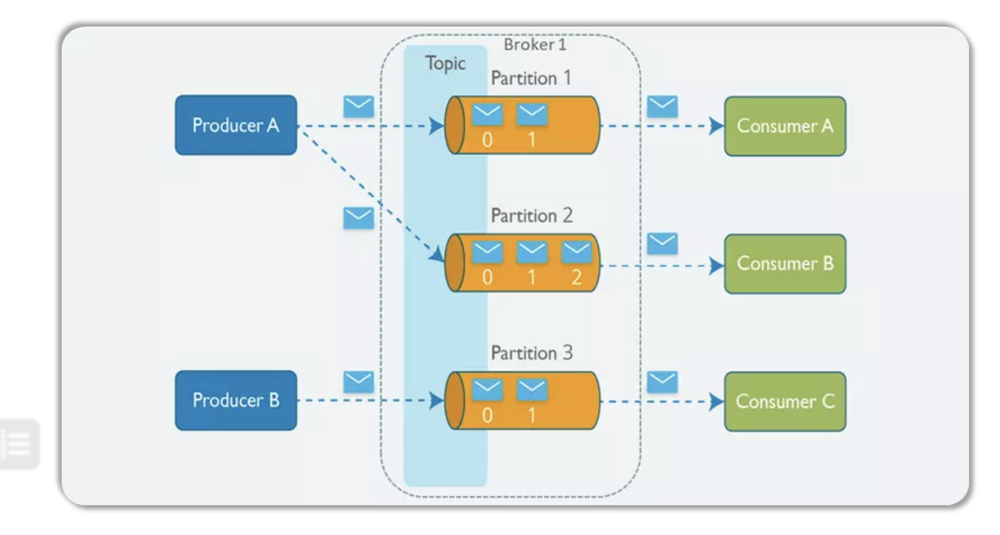

https://topdev.vn/blog/apache-kafka-la-gi/

# Structure

# Concept

Producer: Một producer có thể là bất kì ứng dụng nào có chức năng publish
message vào một topic. Messages: Messages đơn thuần là byte array và developer
có thể sử dụng chúng để lưu bất kì object với bất kì format nào – thông thường
là String, JSON và Avro Topic: Một topic là một category hoặc feed name nơi mà
record được publish. Partitions: Các topic được chia nhỏ vào các đoạn khác nhau,
các đoạn này được gọi là partition Consumer: Một consumer có thể là bất kì ứng
dụng nào có chức năng subscribe vào một topic và tiêu thụ các tin nhắn. Broker:
Kafka cluster là một set các server, mỗi một set này được gọi là 1 broker
Zookeeper: được dùng để quản lý và bố trí các broker.
